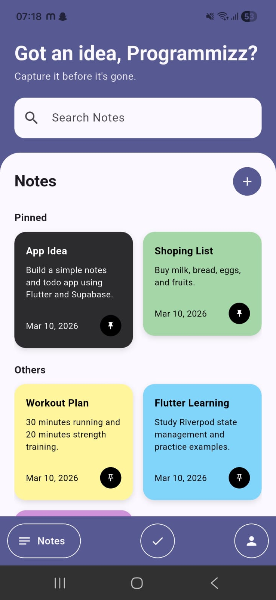
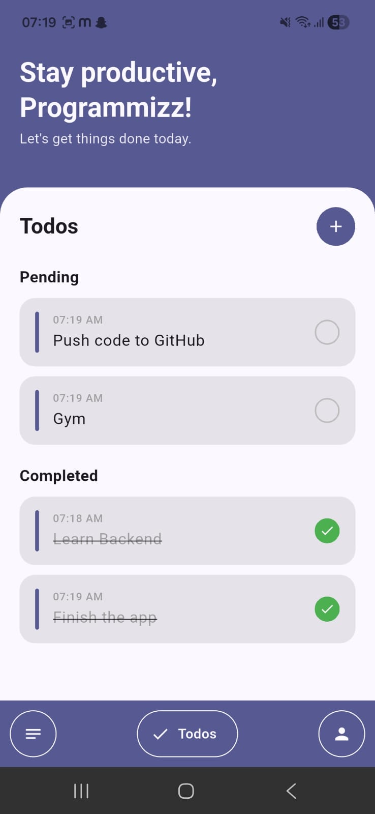
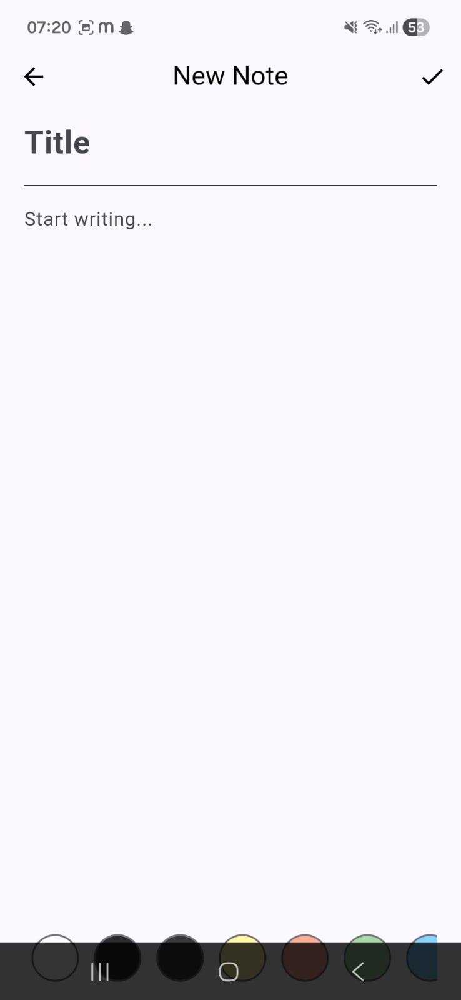
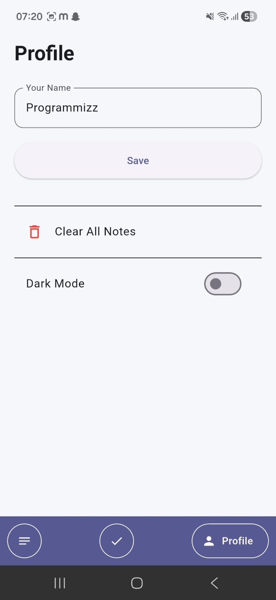

# TickTask


TickTask is a **modern productivity app** built with **Flutter** that combines **notes and task management** in one clean and minimal interface.

It allows users to quickly capture ideas, organize tasks, and stay productive throughout the day.

The app focuses on **speed, simplicity, and a beautiful UI**, with support for **dark mode, color-coded notes, and real-time updates**.

---

# 📸 Screenshots

| Notes Screen                    | Todo Screen                   |
| ------------------------------- | ----------------------------- |
|  |  |

| Add Note                              | Profile                             |
| ------------------------------------- | ----------------------------------- |
|  |  |

---


# ✨ Features

## 📝 Notes Management

* Create and edit notes
* Color-coded notes
* Pin important notes
* Delete notes with confirmation dialog
* Masonry grid layout
* Smooth **Hero animations**
* Real-time updates using streams

---

## ✅ Todo Management

* Create tasks
* Mark tasks as completed
* Auto separation of completed and pending tasks
* Swipe to delete tasks
* Task timestamps
* Clean and minimal task UI

---

## 🔍 Search

* Instant note searching
* Filter by title or body
* Real-time search results

---

## 🎨 UI & UX

* Material 3 design
* Light and Dark theme
* Adaptive text colors
* Smooth animations
* Custom reusable widgets
* Splash screen on app launch

---

## 👤 User Personalization

* Onboarding flow
* User name setup
* Profile screen
* Settings support

---

# 🏗 Architecture

TickTask follows a **clean and scalable architecture** using **Riverpod** for state management and **Isar** for local data persistence.

```
Flutter UI
     ↓
Riverpod Providers
     ↓
Database Services
     ↓
Isar Database
```

Benefits:

* reactive UI updates
* maintainable architecture
* fast local storage
* scalable project structure

---

# 🛠 Tech Stack

| Technology                  | Usage                           |
| --------------------------- | ------------------------------- |
| Flutter                     | Cross-platform UI framework     |
| Dart                        | Programming language            |
| Riverpod                    | State management                |
| Isar                        | High-performance local database |
| Material 3                  | Modern UI design                |
| Intl                        | Date formatting                 |
| Flutter Staggered Grid View | Masonry notes layout            |

---

# 📱 App Screens

* Onboarding Screen
* Name Setup Screen
* Notes Screen
* Add/Edit Note Screen
* Todo Screen
* Profile Screen

---

# 🚀 Installation

### Clone the repository

```bash
git clone https://github.com/Theprogrammizz/ticktask-flutter.git
```

### Navigate into the project

```bash
cd ticktask
```

### Install dependencies

```bash
flutter pub get
```

### Run the application

```bash
flutter run
```

---

# 📦 Build APK

To generate a release APK:

```bash
flutter build apk --release
```

APK location:

```
build/app/outputs/flutter-apk/app-release.apk
```

---

# 📂 Project Structure

```
lib/
 ├── models/
 ├── providers/
 ├── screens/
 ├── widgets/
 ├── services/
 └── main.dart
```

This modular structure keeps the project **clean and scalable**.

---

# 🔮 Future Improvements

Planned improvements for the project:

* Cloud sync with Firebase
* User authentication
* Profile picture support
* Task reminders & notifications
* Drag & drop task reordering
* Export notes

---

# 📄 License

This project is licensed under the **MIT License**.

---

# 👨‍💻 Author

Developed by **TheProgrammizz**

If you like this project, consider giving it a ⭐ on GitHub.
